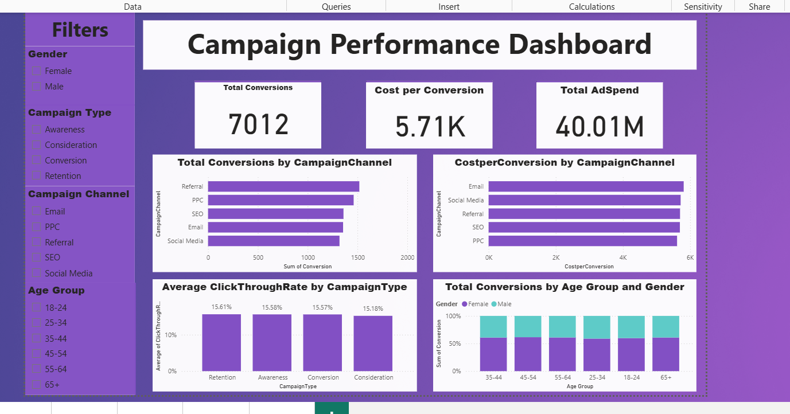

# FUTURE_DS_02

 # Campaign Performance Analysis with Power BI

 # Dashboard Preview
 

📌 Overview

This project was completed as part of Task 2 of my internship with Future Interns. The goal was to analyze an ad campaign dataset from Kaggle using Power BI to uncover insights about campaign performance.

The analysis focuses on key performance metrics such as spend, conversions, and turning raw data into actionable insights for smarter marketing decisions.

📊 Dataset

Source: Kaggle Ad Campaign Dataset (https://www.kaggle.com/datasets/rabieelkharoua/predict-conversion-in-digital-marketing-dataset)

Contains details on campaign platforms, influencer categories, campaign types, and spend/conversions

Cleaned and visualized in Power BI

🔍 Key Insights

Ad Spend vs. Conversions: Helped identify which campaigns delivered more conversions

Campaign Performance Metrics: Highlighted the most effective platforms and strategies

Smarter Decisions: Showed how tracking adspend and cost per conversion helps campaigns adjust to improve ROI

🛠 Tools Used

Power BI → For data cleaning, modeling, and visualization

Kaggle Dataset → As the data source

🎯 Key Lesson
 
Data-driven analysis transforms marketing from guesswork to strategy. Tracking spend against conversions gives clear insights into what works, what doesn’t, and where to optimize.
